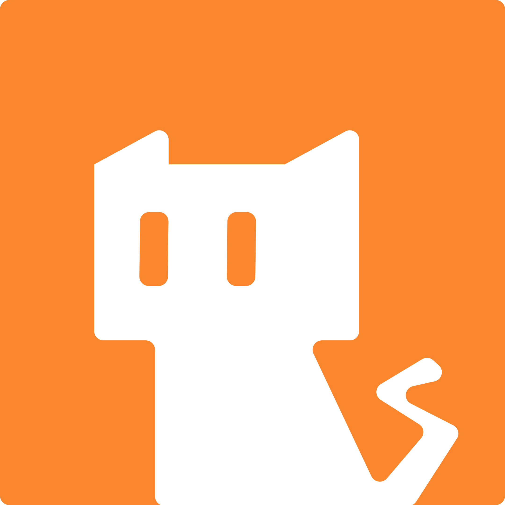
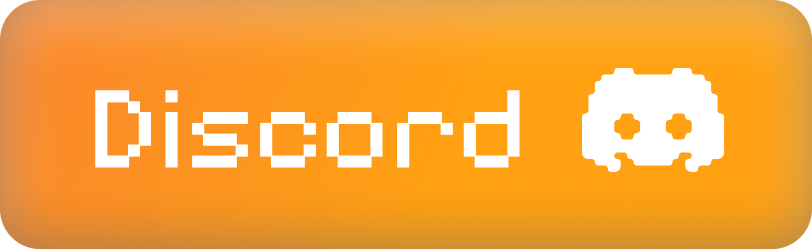

# BitCat Interactive

  <h3>We craft experiences to connect and build memories.</h3>

  
   
   
  

    BitCat Interactive is an independent game studio and product
    company. We build games that bring people together and
    products that help creators, communities, and businesses do
    more.
  

> [!NOTE]
> The official website for BitCat Interactive is actively in
> development, and this page is also a work in progress. In
> addition to the official website, this page provides some
> up-to-date information on projects we are actively working on,
> with changelogs along the way.
>
> **NOTE**: All content on our documentation and organization page
> is subject to change, and as we begin to roll out new features
> and updates for our products, games, or other offerings, the
> information on this page may change.

## About BitCat Interactive

Every project we take on, whether a game, a tool, or a platform,
is built around a simple belief: **experiences, crafted with
care, connect people and build memories.**

Our work spans both game dev and product engineering. For our
games, we build from a range of small multiplayer experiences to
larger narrative-driven worlds. As for our products, we build
community tooling, developer utilities, and platforms directed
towards a B2B and B2C audience.

We're a lean, focused team that care about our craft and our
users. We ship things that people actually want to use through
our own SDLC process.

## Community

Stay connected with the BitCat community! Follow our journey as
we build games and products that bring people together. We share
updates about our projects, development logs, and news across
our official channels.

<h3 align="left">
  
  
  
</h3>

## Other Questions & Concerns

If you have any other questions or concerns regarding our
products or games, or if you are interested in partnering with
BitCat Interactive, please write to us at:

[hello@bitkat.dev](mailto:hello@bitkat.dev).
